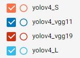
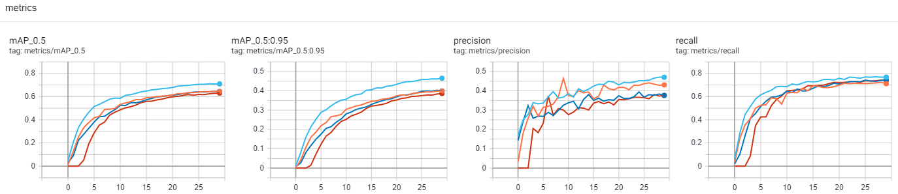
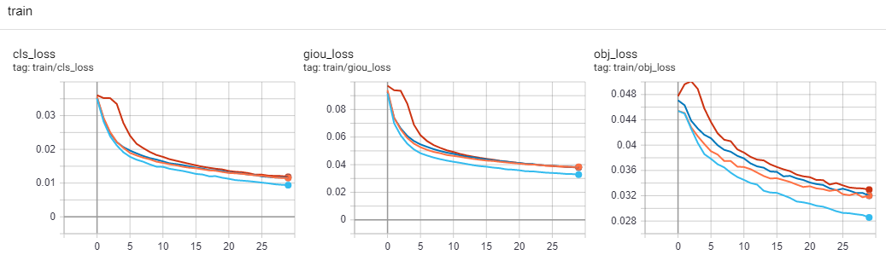

# Yolov4 with VGG Backbone
## 目的:
##### Yolov4/v5 是個強大的物件偵測程式，值得深入研究其結構與效能，最好的方式就是修改其架構然後測試看其效果。 最容易修改的Backbone就是 VGG 系列(vgg11, vgg13, vgg16, vgg19)，這邊嘗試著以此將 Yolov4 的 backbone 做修改。
***
## Backbone 替換
Yolov4:  


***
## yaml 檔修改
##### 原始的 Yolov4_L yaml 檔案的 backbone

##### 修改後的 Yolov4_L_vgg11 yaml, number 表示幾個 CR blocks, args 則包含 channel output 和 stride。

***
## 程式修改
### yolo.py, parse_model() 增加
```
vgg_n=n
elif m is vggLayer:
    c1=ch[f if f<0 else f+1] # input channel
    c2=args[0] # output channel, defined in args of yaml file
    args=[c1,c2,vgg_n,*args[1:]] # modify args as [ch_in, ch_out, num_blocks, stride]

if m is vggLayer:
    m_=m(*args) # create nn module
```
### common.py 增加
```
class vggLayer(nn.Module):
    def __init__(self, c1, c2, n=1, s=2): #chin, chout, block_nums, stride
        super(vggLayer,self).__init__()
        blocks=[nn.Conv2d(c1, c2, kernel_size=3, stride=1, padding=1, bias=True),nn.ReLU(inplace=True)]
        for _ in range(n-1):
            blocks+=[nn.Conv2d(c2, c2, kernel_size=3, stride=1, padding=1, bias=True),nn.ReLU(inplace=True)]
        blocks.append(nn.MaxPool2d(kernel_size=2, stride=s, padding=0, dilation=1))
        self.layers = nn.Sequential(*blocks)
    def forward(self, x):
        return self.layers(x)
```
***
## parameter 變化量
### 原始的 Yolov4_S
```
                 from  n    params  module                                  arguments
  0                -1  1       464  models.common.Conv                      [3, 16, 3, 1]
  1                -1  1      4672  models.common.Conv                      [16, 32, 3, 2]
  2                -1  1      5216  models.common.Bottleneck                [32, 32]
  3                -1  1     18560  models.common.Conv                      [32, 64, 3, 2]
  4                -1  1     19904  models.common.BottleneckCSP             [64, 64, 1]
  5                -1  1     73984  models.common.Conv                      [64, 128, 3, 2]
  6                -1  1    161152  models.common.BottleneckCSP             [128, 128, 3]
  7                -1  1    295424  models.common.Conv                      [128, 256, 3, 2]
  8                -1  1    641792  models.common.BottleneckCSP             [256, 256, 3]
  9                -1  1   1180672  models.common.Conv                      [256, 512, 3, 2]
 10                -1  1   1248768  models.common.BottleneckCSP             [512, 512, 1]
 11                -1  1   1904640  models.common.SPPCSP                    [512, 256, 1]
 
 Model Summary: 226 layers, 9.12461e+06 parameters, 9.12461e+06 gradients
```
### 原始的 Yolov4_L
```
                 from  n    params  module                                  arguments
  0                -1  1       928  models.common.Conv                      [3, 32, 3, 1]
  1                -1  1     18560  models.common.Conv                      [32, 64, 3, 2]
  2                -1  1     20672  models.common.Bottleneck                [64, 64]
  3                -1  1     73984  models.common.Conv                      [64, 128, 3, 2]
  4                -1  1    119936  models.common.BottleneckCSP             [128, 128, 2]
  5                -1  1    295424  models.common.Conv                      [128, 256, 3, 2]
  6                -1  1   1463552  models.common.BottleneckCSP             [256, 256, 8]
  7                -1  1   1180672  models.common.Conv                      [256, 512, 3, 2]
  8                -1  1   5843456  models.common.BottleneckCSP             [512, 512, 8]
  9                -1  1   4720640  models.common.Conv                      [512, 1024, 3, 2]
 10                -1  1  12858368  models.common.BottleneckCSP             [1024, 1024, 4]
 11                -1  1   7610368  models.common.SPPCSP                    [1024, 512, 1]
Model Summary: 334 layers, 5.25155e+07 parameters, 5.25155e+07 gradients
```
### 修改後的 Yolov4_vgg11
```
                 from  n    params  module                                  arguments
  0                -1  1      1792  models.common.vggLayer                  [3, 64, 1, 2]
  1                -1  1     73856  models.common.vggLayer                  [64, 128, 1, 2]
  2                -1  2    885248  models.common.vggLayer                  [128, 256, 2, 2]
  3                -1  2   3539968  models.common.vggLayer                  [256, 512, 2, 2]
  4                -1  2   4719616  models.common.vggLayer                  [512, 512, 2, 2]
  5                -1  1   7086080  models.common.SPPCSP                    [512, 512, 1]
  
Model Summary: 154 layers, 3.46155e+07 parameters, 3.46155e+07 gradients
```
### 修改後的 Yolov4_vgg13
```
                 from  n    params  module                                  arguments
  0                -1  2     38720  models.common.vggLayer                  [3, 64, 2, 2]
  1                -1  2    221440  models.common.vggLayer                  [64, 128, 2, 2]
  2                -1  2    885248  models.common.vggLayer                  [128, 256, 2, 2]
  3                -1  2   3539968  models.common.vggLayer                  [256, 512, 2, 2]
  4                -1  2   4719616  models.common.vggLayer                  [512, 512, 2, 2]
  5                -1  1   7086080  models.common.SPPCSP                    [512, 512, 1]

Model Summary: 158 layers, 3.48e+07 parameters, 3.48e+07 gradients
```
### 修改後的 Yolov4_vgg16
```
                 from  n    params  module                                  arguments
  0                -1  2     38720  models.common.vggLayer                  [3, 64, 2, 2]
  1                -1  2    221440  models.common.vggLayer                  [64, 128, 2, 2]
  2                -1  3   1475328  models.common.vggLayer                  [128, 256, 3, 2]
  3                -1  3   5899776  models.common.vggLayer                  [256, 512, 3, 2]
  4                -1  3   7079424  models.common.vggLayer                  [512, 512, 3, 2]
  5                -1  1   7086080  models.common.SPPCSP                    [512, 512, 1]
  
Model Summary: 164 layers, 4.01097e+07 parameters, 4.01097e+07 gradients
```
### 修改後的 Yolov4_vgg19
```
                 from  n    params  module                                  arguments
  0                -1  2     38720  models.common.vggLayer                  [3, 64, 2, 2]
  1                -1  2    221440  models.common.vggLayer                  [64, 128, 2, 2]
  2                -1  4   2065408  models.common.vggLayer                  [128, 256, 4, 2]
  3                -1  4   8259584  models.common.vggLayer                  [256, 512, 4, 2]
  4                -1  4   9439232  models.common.vggLayer                  [512, 512, 4, 2]
  5                -1  1   7086080  models.common.SPPCSP                    [512, 512, 1]
  
Model Summary: 170 layers, 4.54194e+07 parameters, 4.54194e+07 gradients
```
***
## 測試結果
##### 因為coco 圖片集太多，為實驗方便，此處依舊僅取其車輛部分 names: ['motorcycle','car','bus','truck'], 測試結果如下:





***
## 參考
[Yolov4](https://github.com/WongKinYiu/PyTorch_YOLOv4)  
[VGG](https://pytorch.org/docs/stable/_modules/torchvision/models/vgg.html#vgg11)
